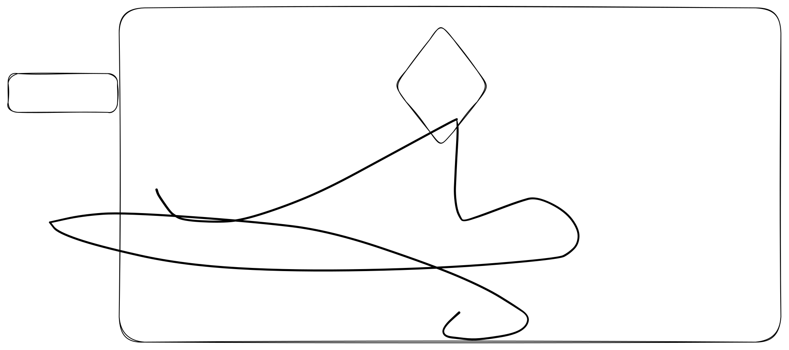

# 软件开发

## 计算机网络

### http








## 操作系统

### 虚拟内存






虚拟内存相当于是CPU与物理内存之间的一个中间层，用来解决以下问题：

1. 内存安全问题：系统的地址映射关系使每个程序访问不同的内存区域，也可以共享。
2. 内存共享问题：
3. 内存大小问题：隔离每个进程，让每个进程认为自己独占内存。使用硬盘，扩大空间。

### 系统调用

```html
<a href="http://www.youtube.com/watch?feature=player_embedded&v=YOUTUBE_VIDEO_ID_HERE
" target="_blank"></a>
```

```markdown
```

[\
](https://chrisniael.gitbooks.io/gitbook-documentation/content/format/chapters.html)\[!\[IMAGE ALT TEXT HERE]\(http://img.youtube.com/vi/YOUTUBE\_VIDEO\_ID\_HERE/0.jpg)]\(http://www.youtube.com/watch?v=YOUTUBE\_VIDEO\_ID\_HERE)

<figure><figcaption></figcaption></figure>












```cpp
// Some co
int a
```



<details>

<summary>12312</summary>

13231

123

12

3

12

</details>


